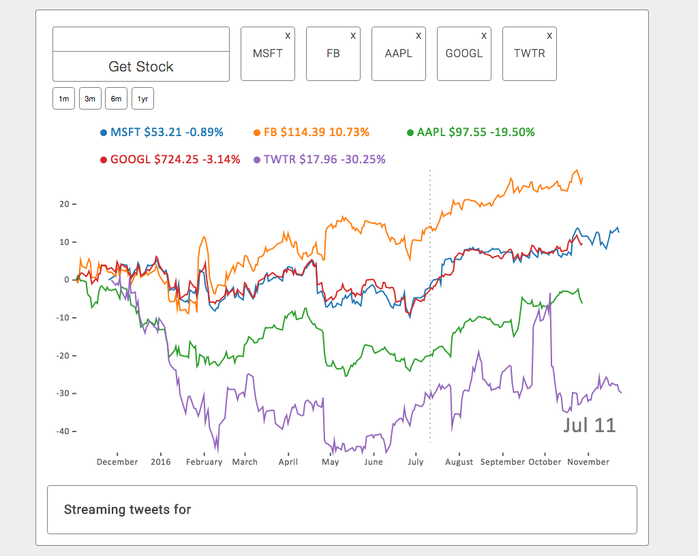

# Chart The Stock Market

## Overview

A real-time stock tracking app that requests data through websocket connections and draws interactive graphs with d3.js and HTML5 canvas. Users can select individual stocks to display Twitter streaming data and explore relationship between company performance and Twitter sentiment.

A demo version of the app is located at https://stock-charts.herokuapp.com/

## Install

The following must be installed to run the project:

* Node    
* NPM
* MongoDB  

And to install the application dependencies:

    $ npm install

## Run

To access the Twitter streaming data, head over to https://apps.twitter.com/ and create a new app.

Save the Twitter API key, API secret, token key, and token secret as environment variables.

See the env.sample.js file for environment variable names.

For the financial data, get an API key from https://www.quandl.com/

Start up a local MongoDB instance or enter a URI in the environment variable.

To start the app:

    $ npm run start

Navigate to

    http://localhost:3000

## Test

To run the test suite, type the command:

    $ npm test

## Stack

| Front-End
|:---------   
| HTML5 / CSS3
| Javascript
| React
| Babel
| Webpack

| Back-End
|:---------   
| Node.js
| Express
| MongoDB       
| Mongoose
| Socket.io

## License

MIT License
